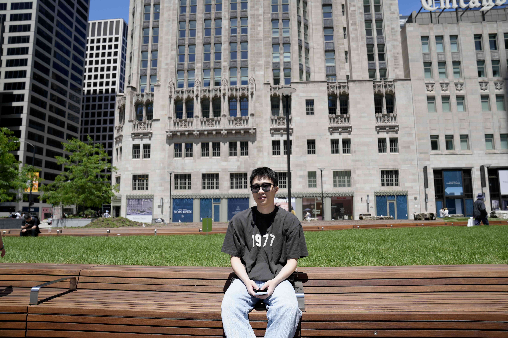

## About me

    
    

    photo taken @ Chicago
    

<ul class="social-media-list">
<li>
I'm currently Principal Researcher at the University of Chicago Booth School of Business, working with Professor Amy Ward.
I received by PhD at Shanghai University of Finance and Economics in 2025, advised by <a href="https://web.stanford.edu/~yyye/">Yinyu Ye</a> and <a href="https://www.acem.sjtu.edu.cn/en/faculty/gedongdong.html"> Dongdong Ge</a>.
</li>
 
<li>
Starting from 2018, I work as an Operations Research Engineer at <a href="https://www.shanshu.ai/">[Cardinal Operations]</a>, where I'm also advised by <a href="https://mypage.cuhk.edu.cn/academics/wangzizhuo/">Zizhuo Wang</a>. 
We build optimization solvers and provide operations research solutions. 
</li>
 
<li>
Before that, I was at the University of Texas at Austin from 2015 to 2017, working with <a href="https://www.me.utexas.edu/people/faculty-directory/bard">Jonathan F. Bard</a>. I did my undergraduate study at <a href="https://www.sjtu.edu.cn/">Shanghai Jiao Tong University</a>.
</li>
 
</ul>

## News
- Apr. 2025, I will join the University of Chicago Booth School of Business as a Principal Researcher, working with Professor Amy Ward.
- Oct. 20-23, 2024, "A Game-Theoretic Framework of Fairness Dynamics: Equilibrium, Control and Beyond" at INFORMS Annual Meeting, Washington, WA.
- July 21-26, 2024, "HSODF: A Homogeneous Framework for Second-Order Methods" at [ISMP](https://ismp2024.gerad.ca/), Montréal, Canada.
- Mar. 2024 - Mar. 2025, I visited Mitchell E. Daniels, Jr. School of Business, Purdue University and Chicago Booth School of Business, working with [Pengyi Shi](https://business.purdue.edu/directory/bio.php?username=shi178) and [Amy Ward](https://www.chicagobooth.edu/faculty/directory/w/amy-ward).
- Dec 2. 2022, Spotlight talk on DRSOM at [NeurIPS HOO](https://neurips.cc/virtual/2022/workshop/50003#wse-detail-64532),  New Orleans, LA.