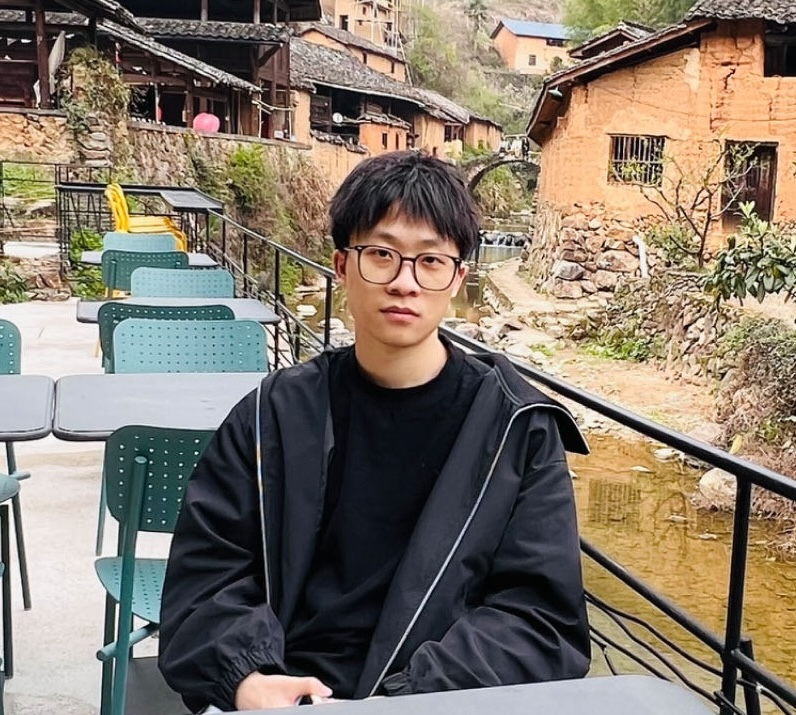

## About me

    
    

    photo taken @ Songyang (<a href="https://www.google.com.hk/maps/place/Songyang+County,+Lishui,+Zhejiang,+China/@28.4202883,118.8186665,10z/data=!3m1!4b1!4m6!3m5!1s0x344889647cb16d17:0xa37eea0f61551760!8m2!3d28.4494699!4d119.48202!16s%2Fm%2F080cn68?authuser=1&entry=ttu">松阳</a>)
    

<ul class="social-media-list">
<li>
I'm currently a PhD student at Shanghai University of Finance and Economics, advised by <a href="https://web.stanford.edu/~yyye/">Yinyu Ye</a> and Dongdong Ge.
</li>
 
<li>
Starting from 2018, I work as an Operations Research Engineer at <a href="https://www.shanshu.ai/" class="cns-large">[杉数科技]</a>, where I'm also advised by <a href="https://mypage.cuhk.edu.cn/academics/wangzizhuo/">Zizhuo Wang</a>. 
We build optimization solvers and provide operations research solutions. 
</li>
 
<li>
Before that, I was at the University of Texas at Austin from 2015 to 2017, working with <a href="https://www.me.utexas.edu/people/faculty-directory/bard">Jonathan F. Bard</a>. I did my undergraduate study at SJTU.
</li>
 
</ul>

## News
- Starting Mar. 2024, I'm visiting Mitchell E. Daniels, Jr. School of Business, Purdue University and Chicago Booth School of Business, working with [Pengyi Shi](https://business.purdue.edu/directory/bio.php?username=shi178) and [Amy Ward](https://www.chicagobooth.edu/faculty/directory/w/amy-ward)
