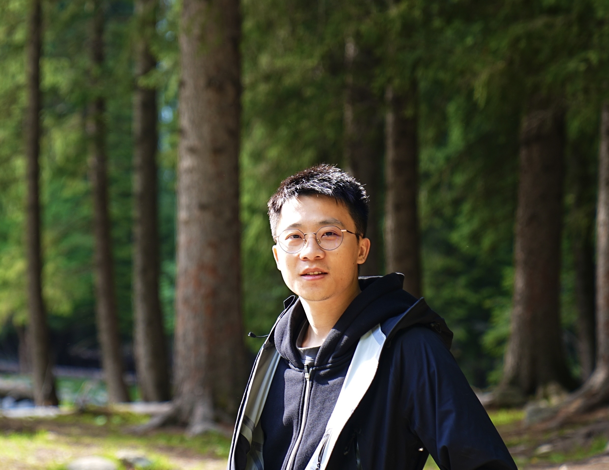

## About me

    
    

    photo taken @ Ili, Xinjiang, China
    

<ul class="social-media-list">
<li>
I'm currently Principal Researcher at the University of Chicago Booth School of Business, working with Professor <a href="https://www.chicagobooth.edu/faculty/directory/w/amy-ward">Amy Ward</a>.
</li>
 
<li>
I received by PhD at Shanghai University of Finance and Economics in 2025, advised by <a href="https://web.stanford.edu/~yyye/">Yinyu Ye</a> and <a href="https://www.acem.sjtu.edu.cn/en/faculty/gedongdong.html"> Dongdong Ge</a>. I was a visiting PhD student of <a href="https://web.ics.purdue.edu/~shi178/"> Pengyi Shi </a> (Purdue University) during 2024-2025.
Starting from 2018, I work as an Operations Research Engineer at <a href="https://www.shanshu.ai/">[Cardinal Operations]</a>. I was fortunate to work with <a href="https://mypage.cuhk.edu.cn/academics/wangzizhuo/">Zizhuo Wang</a> and <a href="https://sites.google.com/site/isyebojiang/"> Bo Jiang</a>.
We build optimization solvers and provide operations research solutions. 
</li>
 
<li>
Before that, I was at the University of Texas at Austin from 2015 to 2017, working with <a href="https://www.me.utexas.edu/people/faculty-directory/bard">Jonathan F. Bard</a>. I did my undergraduate study at <a href="https://www.sjtu.edu.cn/">Shanghai Jiao Tong University</a>.
</li>
 
<li>
Please find my CV <a href="/assets/pdfs/cv2505-complete.pdf">here</a>.
</li>
</ul>

## News

<ul class="news-list">
<li>July 2025, “Price Updates by Interior-Point Methods” at <a href="https://iccopt2025usc.sched.com/event/1dqrb/parallel-sessions-7p-advances-in-nonlinear-optimization-methods-and-applications">ICCOPT</a>, Los Angeles, CA.</li>
<li>Apr 2025, I will join the University of Chicago Booth School of Business as a Principal Researcher, working with Professor Amy Ward.</li>
<li>Oct 2024, “A Game-Theoretic Framework of Fairness Dynamics: Equilibrium, Control and Beyond” at INFORMS Annual Meeting, Washington, WA.</li>
<li>July 2024, “HSODF: A Homogeneous Framework for Second-Order Methods” at <a href="https://ismp2024.gerad.ca/">ISMP</a>, Montréal, Canada.</li>
<li>Mar 2024, I will visit Mitchell E. Daniels, Jr. School of Business, Purdue University and Chicago Booth School of Business, working with Pengyi Shi and Amy Ward.</li>
<li>Dec 31, 2023, A C-implementation of cuPDLP is released, see <a href="https://github.com/COPT-Public/cuPDLP-C">here</a>.</li>
<li>Dec 2, 2022, Spotlight talk on DRSOM at <a href="https://neurips.cc/virtual/2022/workshop/50003#wse-detail-64532">NeurIPS HOO</a>, New Orleans, LA.</li>
</ul>

